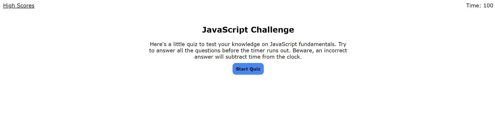

# JavaScript Quiz
Creating a quiz using JavaScript to dynamically generate and interact with HTML elements

## Quiz Requirements
* Quiz starts and timer begins when a button is clicked
* A question is shown and once it is answered another question appears
* Time is subtracted from the clock for incorrect answers
* Option to save initials and high score

## Completed Application
https://tyrictjones.github.io/js-quiz/

